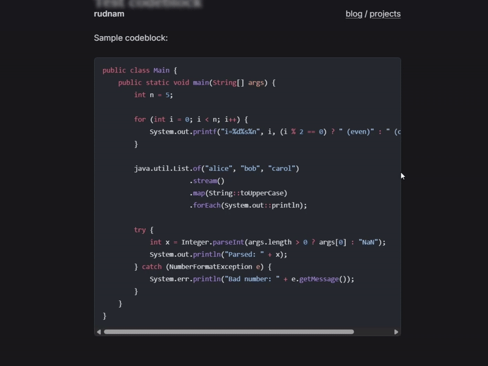

In Astro, code fences (```) come with [built-in syntax highlighting support](https://docs.astro.build/en/guides/syntax-highlighting/) for Shiki and Prism. These, however, do not come with built-in copy to clipboard buttons which can make repeatedly copying code cumbersome.

Luckily, adding a copy button to code blocks can be done with a couple of steps:

## 1. Create a Rehype Plugin

We'll use a custom `rehype-copy-button` plugin to wrap each `<pre><code>` block inside a wrapper as well as insert the copy button.

In `src/rehype/rehype-copy-button.js`:

```js
import { visit } from "unist-util-visit";
import { h } from "hastscript";

export default function rehypeCopyButton() {
  return (tree) => {
    visit(tree, "element", (node, index, parent) => {
      if (node.tagName === "pre" && node.children[0]?.tagName === "code") {
        const wrapper = h("div", { class: "code-wrapper" }, [
          node,
          h("button", { class: "copy-btn", type: "button" }, "Copy"),
        ]);
        parent.children[index] = wrapper;
      }
    });
  };
}
```

Then, enable this plugin in your `astro.config.ts`:

```ts
import rehypeCopyButton from "./src/rehype/rehype-copy-button";

export default defineConfig({
  ...,
  markdown: {
    rehypePlugins: [rehypeCopyButton],
  },
});
```

## 2. Add the CSS for the Copy Button

Add the following CSS to your stylesheet (`global.css` or similar):

```css
.code-wrapper {
  position: relative;
  margin: 1.25rem 0;
}

.code-wrapper pre {
  overflow-x: auto;
  padding-right: 2.5rem;
}

.copy-btn {
  position: absolute;
  top: 0.5rem;
  right: 0.5rem;
  background: rgba(0, 0, 0, 0.6);
  color: white;
  border: none;
  padding: 0.25rem 0.5rem;
  border-radius: 0.25rem;
  font-size: 0.75rem;
  cursor: pointer;
  opacity: 0;
  transition:
    opacity 0.2s,
    background 0.2s;
}

.code-wrapper:hover .copy-btn {
  opacity: 1;
}

.copy-btn:hover {
  background: rgba(0, 0, 0, 0.8);
}
```

## 3. Add the JavaScript for Copy Functionality

Create `public/copy-button.js`:

```js
document.addEventListener("click", (e) => {
  if (!e.target.classList.contains("copy-btn")) return;

  const pre = e.target.previousElementSibling;
  const code = pre.querySelector("code");
  navigator.clipboard.writeText(code.innerText).then(() => {
    e.target.innerText = "Copied!";
    setTimeout(() => (e.target.innerText = "Copy"), 2000);
  });
});
```

Then include it in your Astro layout (e.g., `src/layouts/PageLayout.astro`):

```astro
<body>
  <slot />
  <script type="module" src={`${import.meta.env.BASE_URL}copy-button.js`}></script>
</body>
```

Now, every code block in your markdown posts will have a Copy button that works instantly.


