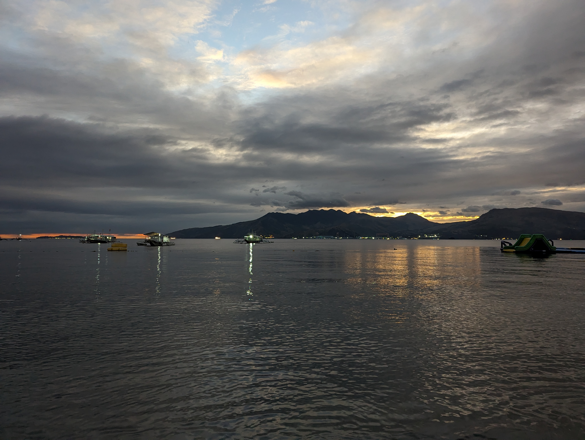

(こちらはテスト用に生成されたブログです。)

## スマホ依存とその影響

スマートフォンは便利なツールである一方で、無意識のうちに多くの時間を奪っている。通知、SNS、動画アプリなどは、設計そのものが「やめにくさ」を前提に作られていると言える。目的もなく触ってしまうことが多く、その結果、集中力の低下や睡眠の質への悪影響も指摘されている。

「使い方を選ぶ」という意識がなければ、こちらが使われてしまう。便利さとコントロールのバランスを見直す時期かもしれない。

## 静かなデザインの価値

最近のウェブサイトはシンプルなレイアウトが増えている。白い余白、読みやすいフォント、最小限のアニメーション。これは見た目だけの問題ではなく、情報を効果的に伝えるための選択だ。派手な装飾よりも、目的が明確な構成の方がユーザーにとって親切である。

美しさは「盛る」ことではなく、「削る」ことで生まれるという考え方が、少しずつ広まってきている。

## 単語の意味とその変化

「便利」という言葉は、かつては物理的な道具や手段を指すことが多かった。しかし現代ではアプリやサービス、さらにはライフスタイルそのものを「便利」と表現するようになった。言葉の意味は時代とともに変化し、その背景にはテクノロジーの進化や価値観の移り変わりがある。

ひとつの単語に注目するだけでも、社会の動きを読み取るヒントになる。
