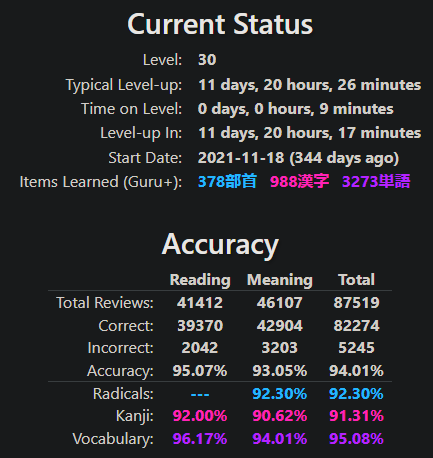

まだまだ作文の練習が必要ですが、これまでの日本語学習について少し振り返ってみたいと思います。

2021年、コロナ禍のロックダウンで時間に余裕があって、人生で初めて日本のアニメを見てみようと思った。それまで日本の文化には特に興味がなかったのに、そのときは時間つぶしでめちゃくちゃ見ていた。

フィリピンのロックダウンは世界的にも長い方だったので、普通の英語のドラマや映画も含めてかなりの量を見ていた。アニメもよく見ていたので、ついでに日本語も勉強してみようかなと思った。時間を無駄にしているような気がしていたので、これで少しは無駄じゃなくなるだろうと思った。

## 初歩

何かを始める前に基本的に自分はリサーチをするので、検索した結果、語彙力のためには「Core 2.3k」というフラッシュカードデッキが良いらしく、文法の勉強にはTae Kim's Grammar Guideが良いらしい。両方ともやってみようとしたが、Core 2.3kは少し難しくて途中でやめ、代わりにWanikaniを使った。

1年目はスローペースだったが、毎日欠かさずWanikaniの単語レビューを続けていた。Grammar Guideもなんとか読み終えた。

Wanikaniを1年間続けた結果の統計はこちら：

## 本格的なスタート

・・・建築中・・・
