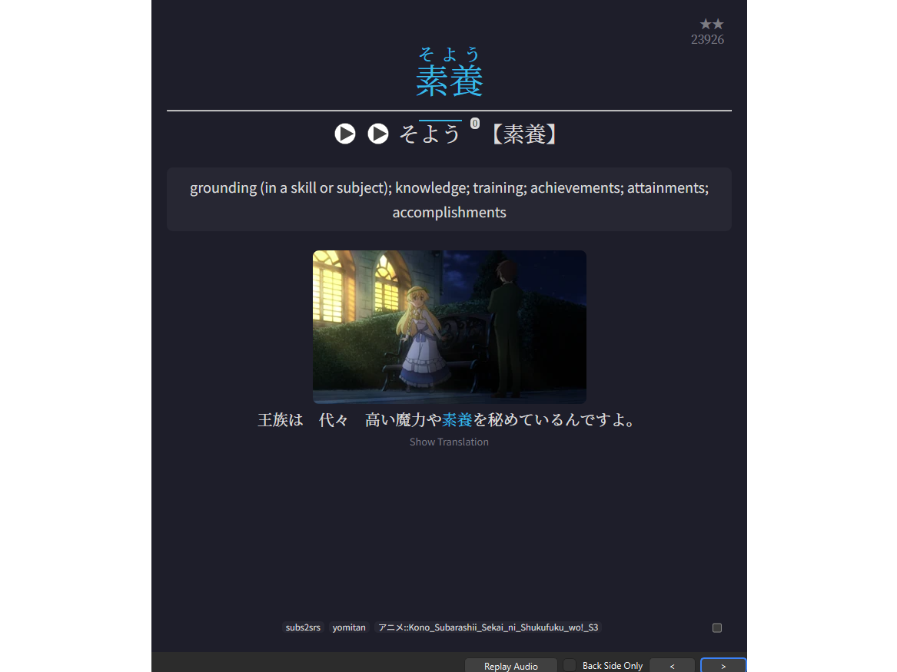
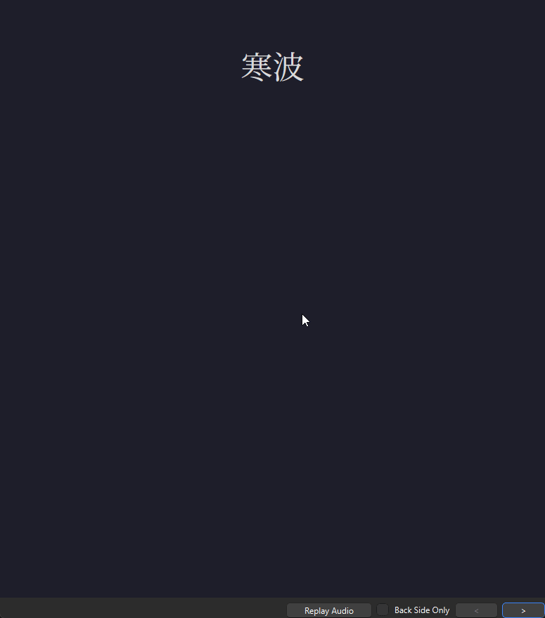

Simple [Anki](https://apps.ankiweb.net/) flashcard template made for learning Japanese. Made with HTML, CSS, and JavaScript.

Supports audio, scrolling definitions, image zoom, pitch coloring, etc.

