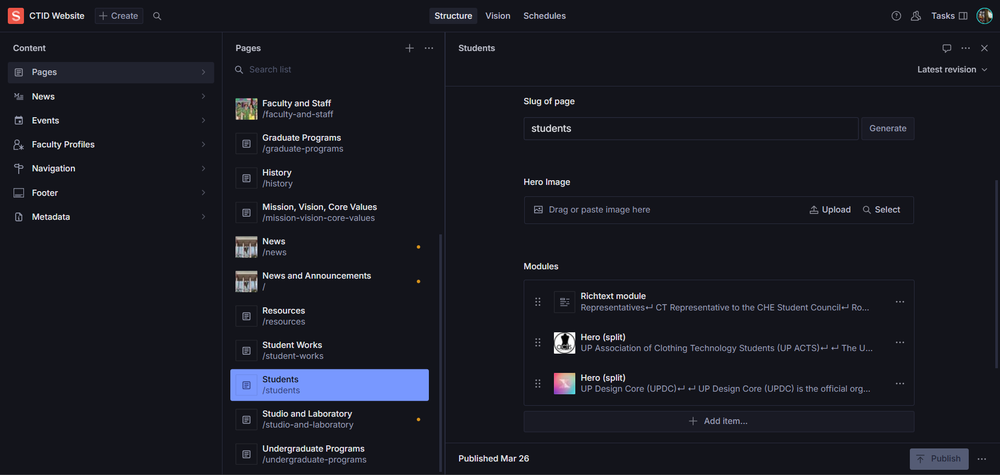

Responsive website for the Department of Clothing, Textiles, and Interior Design at the University of the Philippines Diliman, built for both desktop and mobile use.

Uses a content management system powered by Sanity Studio, enabling faculty to easily update and manage content.

