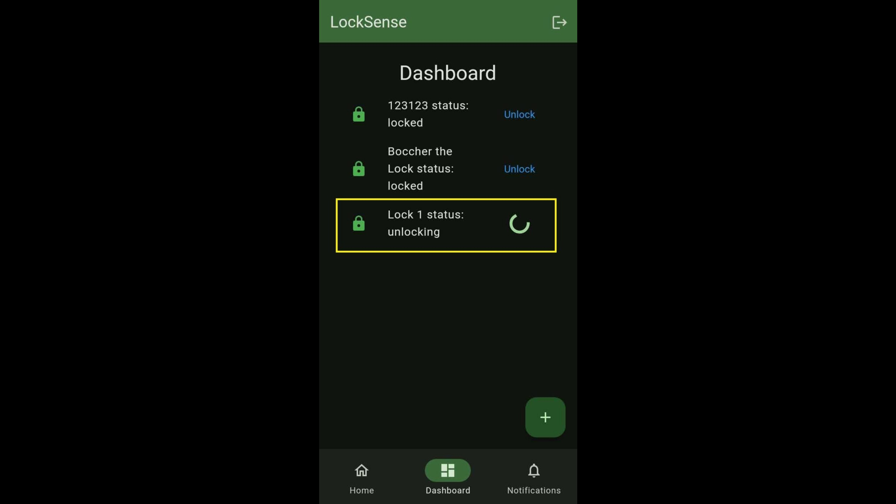
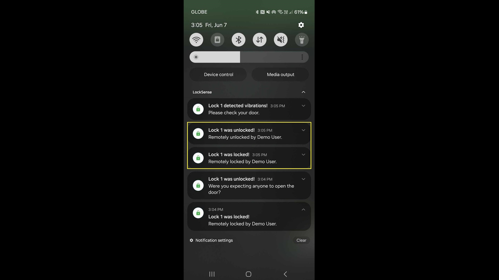
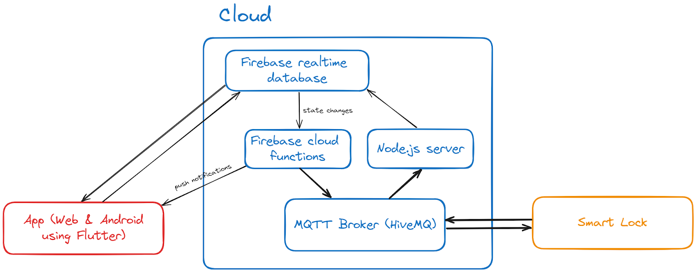

Software side for an IoT smart lock system. Includes a user-facing app and cloud server code.

**Note**: Server is already shut down due to costs — see <a href="https://drive.google.com/file/d/1dBEvbvaglZH1AzWSfaItZwSOcOkWpEUQ" target="_blank">documentation</a>
for full details.

---

### How it works

LockSense is made up of three parts:

- **Smart Lock** – Detects its physical state and communicates via MQTT.

- **Cloud Backend** – Routes commands, updates status using Firebase, and handles push notifications.

- **Mobile/Web App** – Lets users lock/unlock, view status, and get real-time updates.

The system uses MQTT for lightweight messaging and Firebase for fast syncing between the lock and user. Built with Flutter and Node.js.

